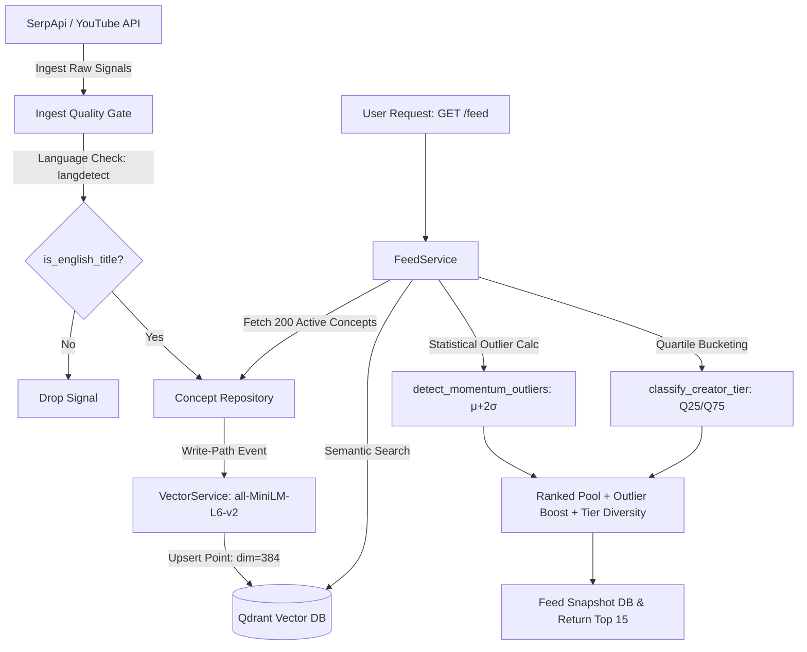

# SYSTEM HANDOFF — CreatorIQ Trend Intelligence Engine

**Target Audience**: Backend Engineers, DevOps / SRE, Data Engineers  
**System Component**: `backend/services/trend/`  
**Current Production Deployment**: Azure Ubuntu VM (`20.2.248.110`), Docker Compose Topology  

---

## 1. System Context & Architecture Role

The `trend` service is responsible for:
1. Ingesting raw signals from SerpApi (Google Trends rising/trending searches) and YouTube Data API v3.
2. Filtering low-quality, non-English, and spam queries.
3. Generating normalized momentum and opportunity scores tailored to a creator's specific niches, geo audience, and preferred formats.
4. Maintaining real-time vector embeddings in **Qdrant Vector DB** for semantic similarity search.
5. Emitting personalized Top 15 opportunities to the frontend.



---

## 2. Key Operational Behaviors

### 2.1 Qdrant Vector Collection Life Cycle
- **Collection Name**: `trend_concepts`
- **Vector Dimension**: `384` (Model: `sentence-transformers/all-MiniLM-L6-v2`)
- **Metric**: Cosine Similarity
- **Self-Healing / Migration**:
  On application startup or before any vector operation, `ensure_collection()` inspects Qdrant. If a collection exists with the legacy dimension (`128`), the service automatically drops the old collection and recreates it with `size=384`.

### 2.2 Write-Path vs. Read-Path Separation
- **Previous state**: Feed queries performed 100 blocking synchronous upserts into Qdrant, freezing FastAPI.
- **Current state**: Upserts are strictly **write-path only** in `concept_collector.py` and `youtube_video_collector.py`. In addition, vector indexing failures are caught and logged without aborting database transactions (best-effort indexing).

### 2.3 Fail-Open Language Detection
`quality_filters.py` uses `langdetect`. If text input is corrupted, non-standard, or if the library throws an exception, the function fails **open** (`return True`) so legitimate English titles are never accidentally dropped due to parsing quirks.

---

## 3. Environment & Configuration Settings

All configurations reside in [`backend/services/trend/app/core/config.py`](file:///c:\Users\Yash\VS_PROJECTS\CreatorIQ\backend\services\trend\app\core\config.py) and pull from the root `.env` file:

| Config Key | Default Value | Purpose |
| :--- | :--- | :--- |
| `QDRANT_URL` | `http://qdrant:6333` | Internal Docker hostname and port for Qdrant |
| `ENABLE_VECTOR_SEARCH` | `True` | Master toggle for semantic embedding and vector similarity |
| `YOUTUBE_API_KEY` | *(Secret)* | Server key for YouTube Data API v3 video lookups |
| `SERPAPI_API_KEY` | *(Secret)* | Key for Google Trends search and rising queries |
| `COLLECTOR_INTERVAL_HOURS` | `4` | Frequency of background cron collection runs |

---

## 4. Failure Modes & Troubleshooting Runbook

### Issue A: Qdrant Connection Failure
- **Symptom**: Logs show `Could not connect to Qdrant at http://qdrant:6333`.
- **Impact**: Non-fatal. The feed service gracefully skips vector scoring and falls back to string/tag matching.
- **Recovery**:
  ```bash
  docker compose restart qdrant
  docker compose logs qdrant --tail 30
  ```

### Issue B: Memory Usage Spike During Initial Inference
- **Symptom**: Container memory increases by ~150MB when the first concept or query is embedded.
- **Explanation**: `all-MiniLM-L6-v2` is loaded into memory on first call (`_get_model()`). This is expected behavior.
- **Safeguard**: Ensure the `trend` container has at least 512MB RAM allocated (the current Azure VM has 4GB total, which is plenty).

### Issue C: Feed Response Takes > 5 Seconds
- **Check**: Verify that the sync upsert loop was not reintroduced in `_build_ranked_pool()`.
- **Diagnostic Command**:
  ```bash
  curl -w "Time Total: %{time_total}s\n" -o /dev/null -s http://localhost:8003/health
  ```
