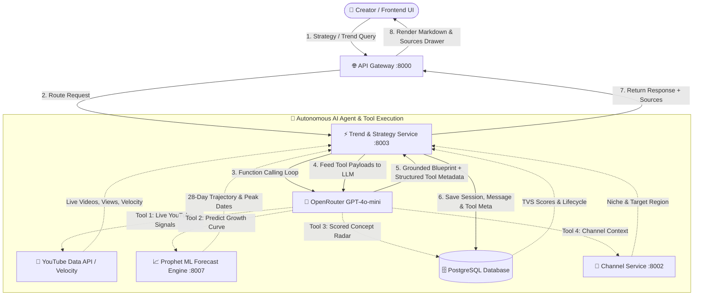

# 🚀 CreatorIQ — AI Trend & Strategy Intelligence Engine

CreatorIQ is an autonomous AI co-pilot and growth platform for YouTube & Shorts creators. It pairs live market signals, proprietary PostgreSQL ingest databases, and custom Prophet Time-Series ML forecasting with OpenRouter LLMs.

---

## 🏗️ System Architecture & AI Tool Flow



---

## ✨ Core Features

### 1. 🤖 Autonomous Tool-Calling AI Strategist
- **Autonomous Tool Execution**: LLM intelligently decides when to invoke internal tools (`get_youtube_trends`, `predict_trend_forecast_ml`, `query_creatoriq_database`, `get_creator_profile`).
- **Executed Tools Bar**: Each AI response highlights active tools (e.g. `⚡ YouTube Data Signals`, `📈 Prophet ML Forecast Engine`, `🗄️ CreatorIQ Ingest Radar`).
- **Sources Drawer (Gemini / ChatGPT Style)**: Interactive slide-over drawer accessible via **"View Sources"** showing exact video velocity metrics, direct YouTube links, ML forecast stats, and concept matches.

### 2. 📈 Prophet ML Forecast Engine (`:8007`)
- Time-series trend trajectory predictions across **7-day**, **28-day**, and **90-day** horizons.
- Evaluates **TVS velocity scores**, **lifecycle stages** (*emerging, growing, peaking*), and **peak date windows**.

### 3. 🎯 Trends Intelligence & Dark Mode Feed History
- **Personalized Signals**: Scored by vector similarity, niche alignment, and geographic audience fit.
- **Dark Mode Feed History Drawer**: Full snapshot archive browser styled in unified dark mode (`#0d0d11`, `#20202a`) with seamless snapshot jumping.
- **Clean Scanner Loader**: Subtle shimmer grid and calm pulse indicators replacing cluttered UI overlays.

### 4. 📄 GitHub README.md Style UI & Markdown Renderer
- **Rich Document Rendering**: GitHub-standard headers, bordered tables, code blocks, blockquotes, and lists via `react-markdown` + `remark-gfm`.
- **Stable UX & Minimalist Nav**: Removed flickering hover buttons, simplified headers, eliminated noisy notification bells, and added stable copy/source actions.
- **Session Persistence**: Permanent chat storage in PostgreSQL with automatic URL state sync (`?session=<id>`).

---

## ⚡ Quick Start

### 1. Start Backend Microservices
```bash
cd backend
docker compose up -d
```

### 2. Start Frontend Dev Server
```bash
cd frontend
bun run dev
```
Open **http://localhost:5173** to access the Dashboard, Trends Intelligence, and AI Strategy Console.
