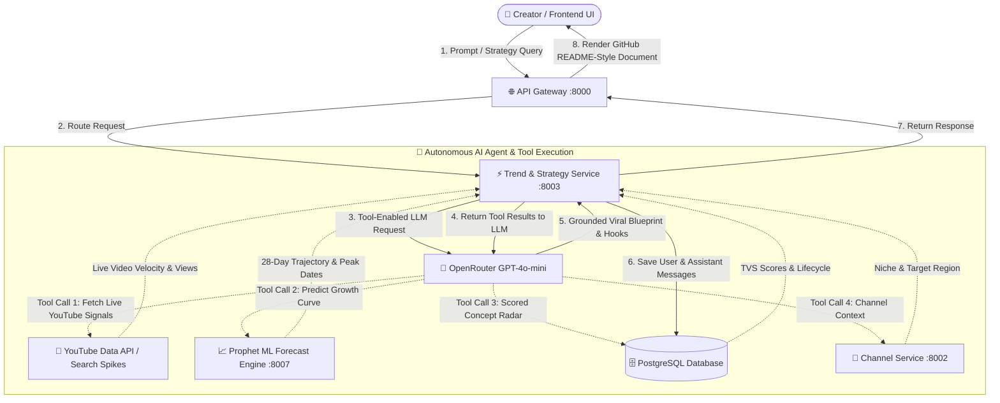

# 🚀 CreatorIQ — AI Trend & Strategy Intelligence Engine

CreatorIQ is an autonomous AI co-pilot and growth platform for YouTube & Shorts creators. It pairs live market signals, proprietary PostgreSQL ingest databases, and custom Prophet Time-Series ML forecasting with OpenRouter LLMs.

---

## 🏗️ System Architecture & AI Tool Flow



---

## ✨ Core Features

### 1. 🤖 Autonomous Tool-Calling AI Strategist
- **Live Tool Loop**: AI autonomously selects and calls internal tools (`get_youtube_trends`, `predict_trend_forecast_ml`, `query_creatoriq_database`, `get_creator_profile`).
- **Tool Execution Transparency**: Each AI response in chat displays an interactive **"Executed Tools"** badge bar showing exactly which tools were triggered (e.g. `[⚡ YouTube Data Signals]`, `[📈 Prophet ML Forecast Engine]`, `[🗄️ CreatorIQ Ingest Radar]`).
- **No Generic Disclaimers**: Directly cites live YouTube video data (views, velocity, channels) and proprietary momentum scores.

### 2. 📈 Trained Prophet ML Forecast Engine (`:8007`)
- Time-series trend growth prediction over **7-day**, **28-day**, and **90-day** horizons.
- Calculates **TVS velocity scores**, **lifecycle state** (*emerging, growing, peaking*), and **peak date windows**.

### 3. 🗄️ Real-Time Database Ingest Radar
- PostgreSQL database stores scored concepts, momentum velocity, search spikes, and creator blueprints.
- User-isolated conversation history persisted permanently in `chat_sessions` and `chat_messages` tables.

### 4. 📄 GitHub README.md Style UI & Markdown Renderer
- **Rich Document Rendering**: GitHub-standard headers, bordered tables, code snippets, blockquotes, and lists powered by `react-markdown` and `remark-gfm`.
- **Sleek Input Box**: Auto-expanding multiline capsule with keyboard shortcuts (`Enter` to send, `Shift+Enter` for newline) and one-click tool quick-launch pills.
- **Auto-Restore & URL Sync**: Conversation state automatically syncs with URL (`?session=<id>`) and persists on page reloads.

---

## ⚡ Quick Start

### 1. Start Backend Microservices
```bash
cd backend
docker compose up -d
```

### 2. Start Frontend Dev Server
```bash
cd frontend
bun run dev
```
Open **http://localhost:5173** to access the Dashboard and AI Strategy Console.
