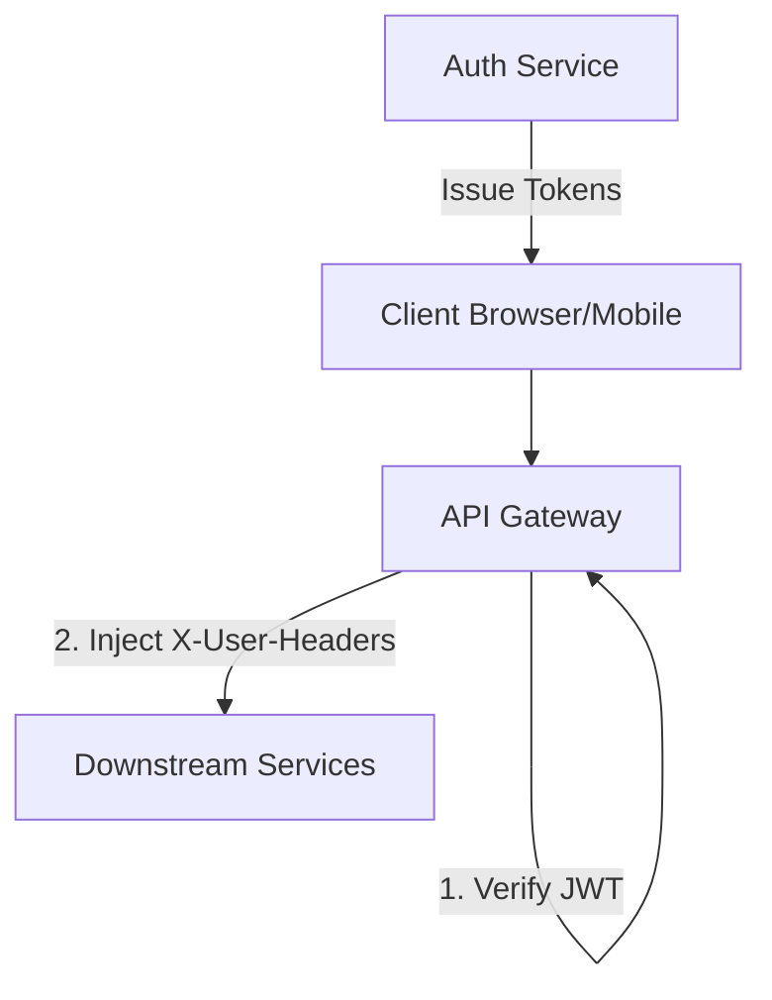

# Developer Guide: Authentication & Authorization

This document outlines the authentication and authorization (Auth/AuthZ) architecture for CreatorIQ microservices.

---

## 🏗️ Architecture Overview

CreatorIQ follows a **Centralized Authentication with Edge Verification** pattern. Security is enforced at the network edge (API Gateway), while identity is propagated to downstream services via trusted HTTP headers.



---

## 👤 Auth Service (`/services/auth`)

The Core Identity Provider (IdP) for the system.

### Key Responsibilities:
- **User Management**: Registration, login, password hashes (Bcrypt).
- **Token Issuance**:
    - **Access Token**: JWT signed with RS256 (RSA Private Key). Contains `sub` (User ID), `email`, and `plan_tier`.
    - **Refresh Token**: Opaque, secure random string. Stored as SHA-256 hash in the DB.
- **OAuth Integration**: Handles Google/YouTube OAuth flows.
- **Token Encryption**: Third-party OAuth tokens (e.g., YouTube `access_token`) are encrypted using **AES (Fernet)** before being persisted in the database.

---

## 🌉 API Gateway (`/services/api-gateway`)

The Entry Point and Security Enforcer.

### Key Responsibilities:
- **JWT Verification**: Decodes the `Authorization: Bearer` token using the **RSA Public Key**.
- **Public & Internal Path Handling**:
    - **Public Paths**: Routes like `/v1/auth/login` or `/v1/auth/health` are allowed without a token.
    - **Internal Paths**: Routes containing `/internal/` bypass JWT check but **must** be secured by `X-Internal-Service-Token` at the service level.
- **Header Injection (Identity Propagation)**:
  Once a token is verified, the Gateway extracts claims and injects them as custom headers:
    - `X-User-Id`: The user's UUID.
    - `X-User-Email`: The user's email address.
    - `X-Plan-Tier`: The user's subscription level (e.g., `free`, `pro`, `enterprise`).

---

## 🛠️ Downstream Services (Planner, Analytics, etc.)

Business logic services trust the identity provided by the Gateway.

### Consuming User Identity:
Services should use the standard codebase dependency to retrieve user context:

```python
# Example from planner/app/core/deps.py
def get_user_context(
    x_user_id: str = Header(...),
    x_plan_tier: str = Header(None)
) -> UserContext:
    # Logic to parse and provide the UserContext object
```

> [!IMPORTANT]
> Downstream services **do not** re-verify the JWT. They trust the `X-User-Id` header. For this reason, these services should **never** be exposed directly to the internet without the API Gateway in front.

---

## 🔒 Internal Service Communication

For service-to-service calls (e.g., a background worker calling the Auth service), we use a shared secret.

- **Header**: `X-Internal-Service-Token`
- **Secret**: Defined in the root `.env` as `INTERNAL_SERVICE_TOKEN`.
- **Dependency**: Use `require_internal_token` in your API routes to protect internal endpoints.

---

## 🔑 Security Configuration & Secrets

### RSA Keys
The system uses asymmetric encryption (RS256) for JWTs.
- `jwt_private.pem`: Only the **Auth Service** needs this for signing tokens.
- `jwt_public.pem`: **All Services** (especially the Gateway) need this for verifying tokens.

### Environment Variables (.env)
- `JWT_ISSUER`: `creatoriq-auth`
- `JWT_AUDIENCE`: `creatoriq-api`
- `AES_ENCRYPTION_KEY`: A Fernet-compatible key for encrypting 3rd-party tokens.
- `INTERNAL_SERVICE_TOKEN`: The shared secret for trusted internal calls.

---

## 🚀 Development Workflow

1.  **Local Secrets**: Ensure `jwt_private.pem` and `jwt_public.pem` exist in the `backend/secrets/` directory.
2.  **Auth Flow**:
    - Call `POST /v1/auth/login` to get tokens.
    - Use the `access_token` in the `Authorization: Bearer <token>` header for subsequent calls to `/v1/*`.
3.  **Testing Internal APIs**: Use a tool like Postman/Curl and set the `X-Internal-Service-Token` header for requests starting with `/v1/internal/*`.
