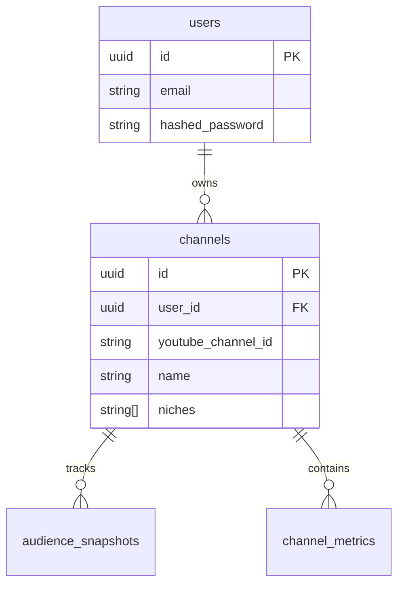
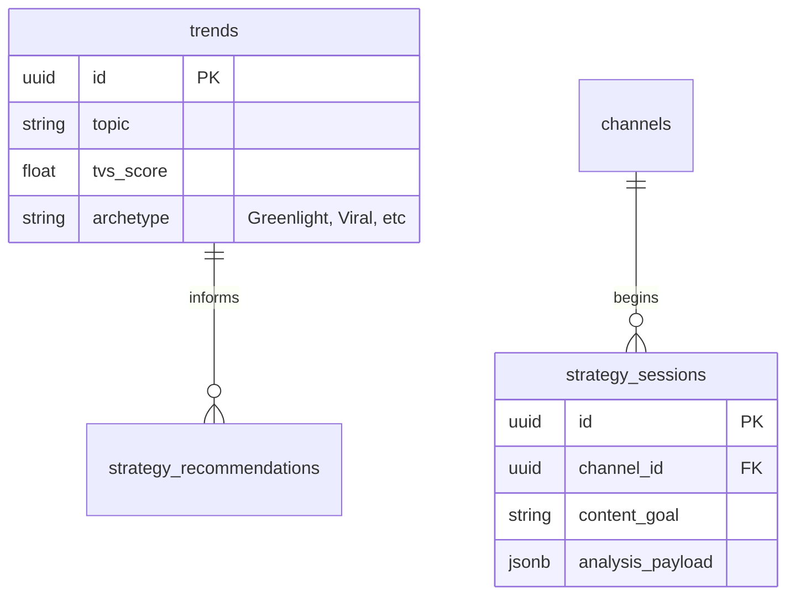
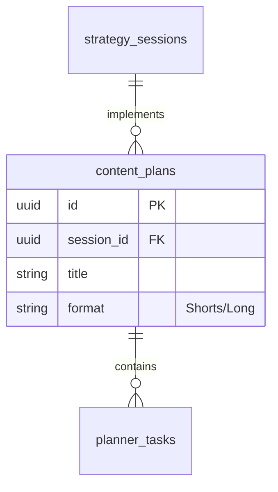

# CreatorIQ Master Database Schema

This document outlines the shared schema in the `CreatorIQ` database and the cross-service data flow.

## Identity & Core Context (Auth & Channel)

These tables form the foundation of the system. Most other services reference `user_id` or `channel_id`.

## Discovery & Strategy (Trend & Strategy)

The Trend service discovers global topics, which the Strategy service then maps to specific channel growth plans.

## Planning & Production (Planner)

The final stage where strategy becomes actionable tasks.

## Global Standards

| Entity | Type | Requirement |
| :--- | :--- | :--- |
| **All Primary Keys** | `UUID` | Default to `uuid.uuid4()` |
| **Timestamps** | `TIMESTAMP(timezone=True)` | Use `func.now()` for `created_at` |
| **JSON** | `JSONB` | Preferred for unstructured payload data |
| **Decimal** | `Numeric(10, 2)` | Use for scores and financial metrics |

## Cross-Service Communication
Services should **never** join tables across different service namespaces directly in code (though the DB allows it). Instead:
1.  **Gateway** passes `X-User-Id` header.
2.  Service A requests data from Service B via **Internal API**.
3.  Service A caches necessary foreign keys (like `channel_id`) to perform its own local joins.
