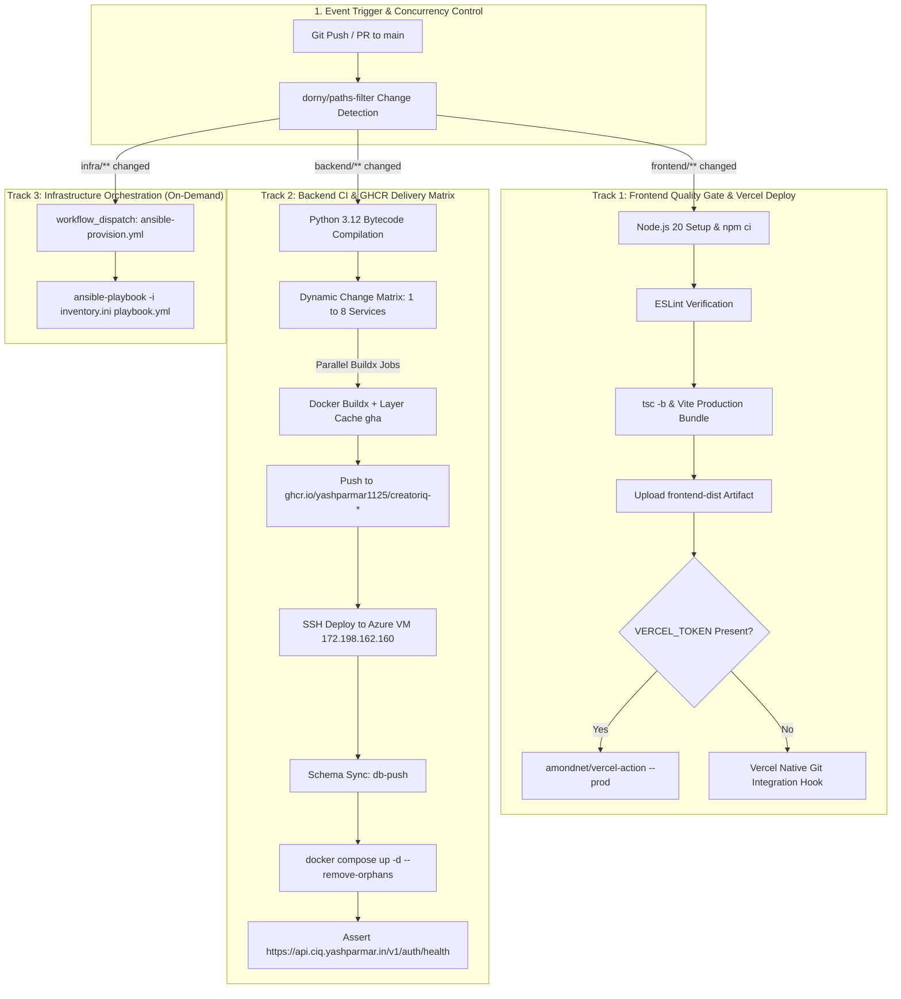

# CreatorIQ: Enterprise Parallel CI/CD Architecture Specification

**Version:** 3.0  
**Status:** Production Standard  
**Scope:** Parallel Multi-Track Workflows, Path-Based Change Detection, Frontend Vercel Integration, Backend GHCR Matrix Builds, and Zero-Downtime VM Rollouts.

---

## 1. Architecture Overview

CreatorIQ uses an **enterprise-grade, decoupled multi-track CI/CD pipeline**. Rather than running monolithic sequential builds that waste runner minutes and block releases, the pipeline splits execution into parallel, independent tracks:

1. **Track 1: Frontend Pipeline**: Linting, strict TypeScript verification, Vite production packaging, and automated Vercel deployment.
2. **Track 2: Backend Microservices Pipeline**: Selective change detection across 8 microservices, parallel Docker Buildx matrix builds, GHCR publishing, and SSH rollout to the Azure VM.
3. **Track 3: Infrastructure Playbooks**: Idempotent Ansible orchestration for VM system dependencies, swap allocation, UFW firewall hardening, and Caddy auto-SSL configuration.

---

## 2. End-to-End Pipeline Workflow Diagram



---

## 3. Path-Based Selective Change Detection

In enterprise microservice repositories, building every service on every commit introduces unnecessary lag and consumes runner capacity. CreatorIQ employs `dorny/paths-filter` to dynamically compute build targets:

| Component Changed | Triggered Actions | Untouched Components (Skipped) |
| :--- | :--- | :--- |
| `frontend/**` | Frontend lint, compile, and Vercel rollout | Backend Docker builds are skipped |
| `backend/services/ml/**` | Only `ciq-ml` image is built and rolled out | Remaining 7 backend services skipped |
| `backend/services/auth/**` | Only `ciq-auth` image is built and rolled out | Remaining 7 backend services skipped |
| `backend/docker-compose.prod.yml` | All 8 backend microservices rebuilt | Frontend pipeline skipped |
| `infra/**` | Ansible syntax check and server provisioning | Application builds skipped |

---

## 4. Track 1: Frontend CI/CD Specification

### 4.1 Workflow Files
- **Quality Gate**: [`.github/workflows/ci.yml`](file:///.github/workflows/ci.yml)
- **Deployment**: [`.github/workflows/deploy-frontend.yml`](file:///.github/workflows/deploy-frontend.yml)

### 4.2 Quality Gates Executed
1. **Deterministic Dependency Installation**: Uses `npm ci` referencing `package-lock.json`.
2. **ESLint Verification**: Audits code for syntax, hook compliance, and TypeScript best practices.
3. **Type Safety Validation**: Runs `tsc -b` (TypeScript Project References) with zero tolerance for compiler errors.
4. **Vite Production Bundling**: Produces optimized chunks with tree-shaking, minification, and CSS extraction into `frontend/dist`.
5. **Artifact Retention**: Bundles are uploaded to GitHub Artifacts for 7-day retention and auditability.

### 4.3 Vercel Deployment Integration
- **SPA Routing**: Configured via [`frontend/vercel.json`](file:///frontend/vercel.json) with client-side rewrites:
  ```json
  {
    "rewrites": [{ "source": "/(.*)", "destination": "/index.html" }],
    "headers": [
      {
        "source": "/(.*)",
        "headers": [
          { "key": "X-Content-Type-Options", "value": "nosniff" },
          { "key": "X-Frame-Options", "value": "DENY" }
        ]
      }
    ]
  }
  ```
- **Environment Variables**:
  - `VITE_API_URL`: Configured to `https://api.ciq.yashparmar.in/v1`.

---

## 5. Track 2: Backend CI/CD & GHCR Delivery

### 5.1 Workflow Files
- **Continuous Deployment**: [`.github/workflows/deploy-backend.yml`](file:///.github/workflows/deploy-backend.yml)

### 5.2 Container Registry & Image Tagging
All microservice containers are tagged with immutable and mutable identifiers in the GitHub Container Registry:
- **`ghcr.io/yashparmar1125/creatoriq-<service>:sha-<commit-sha>`** (Immutable deployment artifact)
- **`ghcr.io/yashparmar1125/creatoriq-<service>:<branch>`** (Branch tracking tag)
- **`ghcr.io/yashparmar1125/creatoriq-<service>:latest`** (Latest production release)

### 5.3 Zero-Downtime VM Rollout Sequence
The deployment step connects to `ciq` via SSH and executes [`backend/scripts/deploy.sh`](file:///backend/scripts/deploy.sh):
1. **Image Pull**: Pulls refreshed images from GHCR.
2. **Core Database Health Gate**: Asserts that `ciq-postgres` and `ciq-redis` are healthy.
3. **Database Schema Sync**: Runs `docker compose --profile db-push run --rm db-push-<svc>` to apply SQLAlchemy schema updates.
4. **Container Replacement**: Replaces running containers with zero downtime (`up -d --remove-orphans`).
5. **Loopback Gateway Verification**: Confirms that `ciq-api-gateway` binds only to `127.0.0.1:8000`, forcing external traffic through Caddy's HTTPS termination.
6. **Health Check Assertion**: Probes `https://api.ciq.yashparmar.in/v1/auth/health` over public internet.

---

## 6. Required GitHub Secrets Reference

Configure these repository secrets in **GitHub Repository $\to$ Settings $\to$ Secrets and variables $\to$ Actions**:

| Secret Name | Required For | Source / Value |
| :--- | :--- | :--- |
| **`SSH_PRIVATE_KEY`** | Automated SSH deployment to Azure VM | Content of `C:\Users\Yash\.ssh\ciq_key.pem` |
| **`GITHUB_TOKEN`** | Pulling/Pushing to GHCR | Automatically injected by GitHub Actions (`packages: write`) |
| **`VERCEL_TOKEN`** *(Optional)* | Triggering Vercel deployment via CLI action | Generated in Vercel Account Settings |
| **`VERCEL_ORG_ID`** *(Optional)* | Linking Vercel project | Found in `.vercel/project.json` or project settings |
| **`VERCEL_PROJECT_ID`** *(Optional)* | Linking Vercel project | Found in `.vercel/project.json` or project settings |

*(Note: If `VERCEL_TOKEN` is omitted, the pipeline still executes all quality gates, and Vercel's native GitHub integration handles the automatic deployment on push to `main`)*.

---

## 7. Manual Workflow Triggers

All workflows support manual execution via GitHub Actions UI (`workflow_dispatch`):
1. **`deploy-backend.yml`**:
   - `force_build_all`: Check this box to force rebuild all 8 microservices regardless of Git changes.
   - `deploy_to_vm`: Toggle whether to roll out to the Azure VM after image build.
2. **`ansible-provision.yml`**:
   - Re-runs the full server configuration playbook (Docker, UFW, Swap, Caddy) against the VM on demand.
