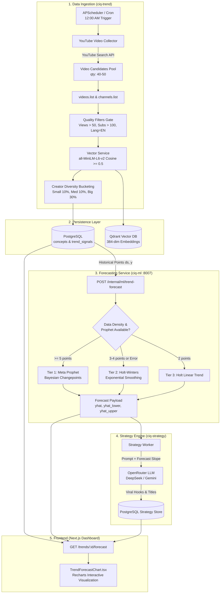
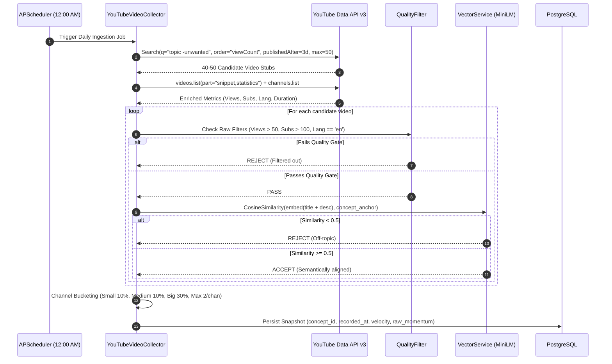
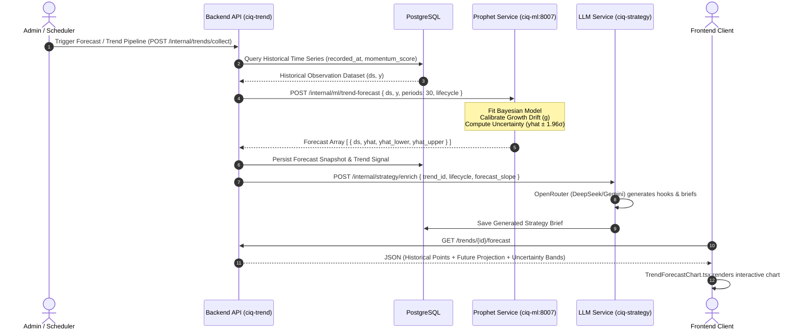
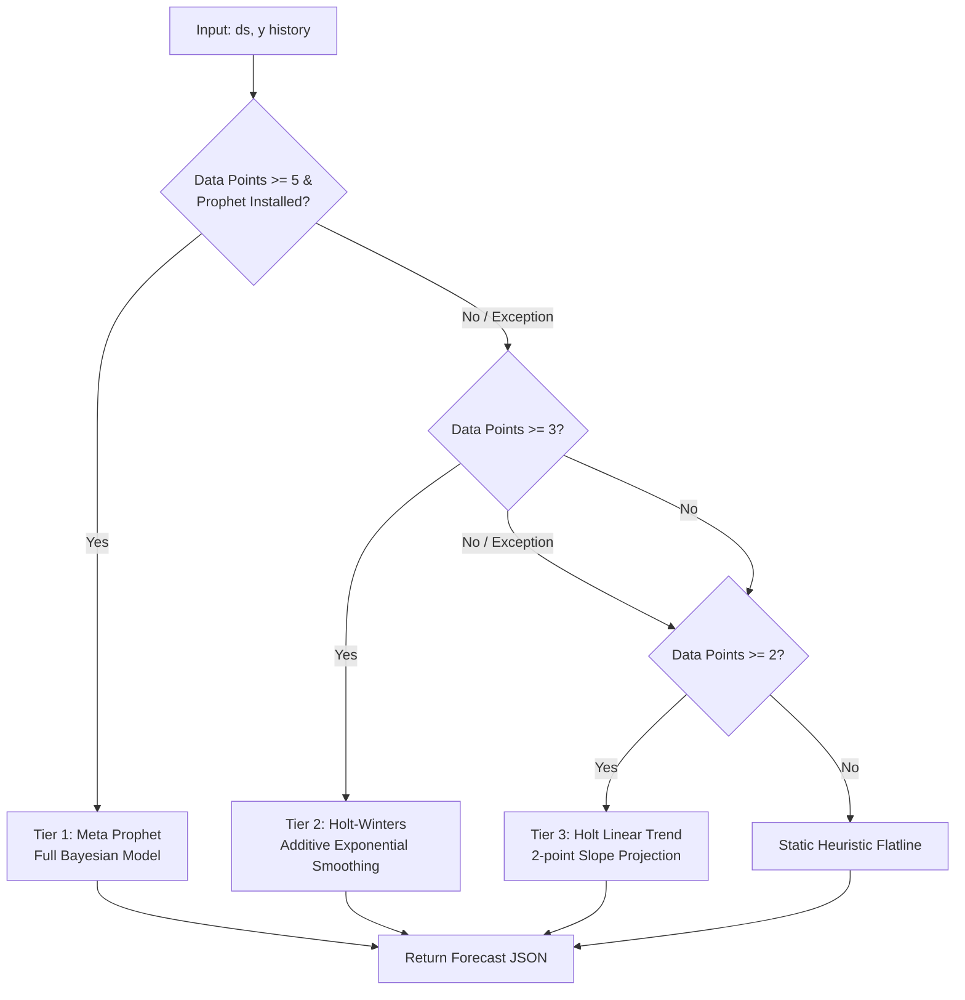

# CreatorIQ: End-to-End Trend Ingestion, Prophet Forecasting & LLM Strategy Architecture

**Version:** 2.0  
**Status:** Production Ready  
**Scope:** Ingestion Pipeline, Vector Embeddings, Meta Prophet Forecasting Engine, LLM Strategy Enrichment, and Frontend Visualization.

---

## 1. Executive Summary

CreatorIQ's Trend Prediction Architecture transforms raw social media signals into predictive, actionable intelligence for YouTube content creators. Rather than relying solely on lagging historical metrics (e.g., view counts from last week), the system executes a continuous pipeline:

1. **Ingests & Filters** real-world YouTube videos using strict quality gates and creator diversity quotas.
2. **Embeds & Classifies** content semantically using `all-MiniLM-L6-v2` dense vector embeddings.
3. **Forecasts Trajectories** up to 30 days ahead using a Bayesian **Meta Prophet** model with dynamic lifecycle-aware growth rates and a 3-tier mathematical fallback hierarchy.
4. **Enriches with AI Strategy** using LLMs to generate high-CTR titles, viral hooks, and optimal publishing windows based on the forecast curve.
5. **Renders Interactively** on the creator dashboard with Bayesian uncertainty bands ($\hat{y}_{lower}$ to $\hat{y}_{upper}$).

---

## 2. High-Level Architecture Overview

The system consists of containerized microservices communicating asynchronously via Redis/REST and persisting data in PostgreSQL and Qdrant:



---

## 3. Data Ingestion Pipeline (Handwritten Spec Implementation)

The ingestion pipeline executes the exact logic specified in the system design:



### 3.1 Implementation Details

1. **Scheduling (`backend/services/trend/app/main.py`)**:
   - Managed via `AsyncIOScheduler`.
   - Runs recurring jobs at midnight (`12:00 AM`) and interval-based scans across all taxonomy clusters (`Gaming`, `Tech`, `Finance`, `Entertainment`, `Fitness`, etc.).

2. **YouTube Harvesting (`youtube_video_collector.py` & `youtube_data_client.py`)**:
   - Dispatches `search.list` with negative keyword exclusions:
     ```python
     candidates = await client.search_videos(
         q=query,
         region_code="IN", # or target audience geo
         published_after_days=3,
         order="viewCount",
         video_duration="short" if is_entertainment else "any",
         max_results=50
     )
     ```
   - Batches IDs to query `videos.list` and `channels.list` in single network roundtrips to conserve YouTube API quota.

3. **Hard Quality Filters (`quality_filters.py`)**:
   - **View Floor**: Videos with $< 50$ views are dropped.
   - **Subscriber Floor**: Channels with $< 100$ subscribers are dropped.
   - **Language Gate**: Language is analyzed via `langdetect` with noise stripping; non-English titles are rejected.
   - **Scandal/Clickbait Rejection**: High-precision regex filters eliminate non-actionable news and scandal queries (e.g., `\barrested\b`, `\bviral news\b`, `\bdeath\b`, `\bmurder\b`).

4. **Semantic Embedding (`vector_service.py`)**:
   - Model: `sentence-transformers/all-MiniLM-L6-v2` (384-dimensional dense vectors).
   - Generates document embeddings from `(title + description)` and computes cosine similarity against the canonical concept anchor.
   - Cutoff threshold: $\text{Cosine Similarity} \ge 0.5$.

5. **Creator Bucketing & Diversity**:
   - Creators are categorized into **Small** ($<10\text{K}$ subs), **Medium** ($10\text{K}-100\text{K}$ subs), and **Big** ($>100\text{K}$ subs).
   - A diversity quota prevents dominant channels from hijacking the trend score: max 2 videos per channel per concept snapshot.

---

## 4. End-to-End Execution Sequence (Mermaid Diagram Implementation)

The operational sequence synchronizing all services for forecasting and user delivery:



---

## 5. Meta Prophet Forecasting Engine

The forecasting engine in `backend/services/ml/app/services/forecast_engine.py` generates forward-looking projections from the observation cutoff point.

### 5.1 Mathematical Formulation

Meta Prophet models the trend time series as an additive decomposable model:

$$y(t) = g(t) + s(t) + h(t) + \epsilon_t$$

Where:
- **$g(t)$ is the Trend Function**: Piecewise linear growth that models non-periodic changes in velocity:
  $$g(t) = (k + \mathbf{a}(t)^T \boldsymbol{\delta}) t + (m + \mathbf{a}(t)^T \boldsymbol{\gamma})$$
  - $k$: Base growth rate.
  - $\boldsymbol{\delta}$: Vector of rate adjustments at changepoints $s_j$.
  - $\mathbf{a}(t)$: Binary indicator vector showing which changepoints have occurred by time $t$.
- **$s(t)$ is Seasonality**: Multi-period seasonality modeled using Fourier series:
  $$s(t) = \sum_{n=1}^{N} \left( a_n \cos\left(\frac{2\pi n t}{P}\right) + b_n \sin\left(\frac{2\pi n t}{P}\right) \right)$$
  *(Weekly seasonality $P=7$ captures creator weekend publishing spikes).*
- **$h(t)$ is Holiday/Event Effects**: Known shock dates (e.g., product launches, holidays).
- **$\epsilon_t$ is the Error Term**: Normally distributed error $\sim \mathcal{N}(0, \sigma^2)$.

### 5.2 Uncertainty Estimation

Prophet generates Bayesian posterior predictive intervals by sampling future changepoints:

$$\hat{y}_{\text{upper}} = \hat{y}(t) + z \cdot \hat{\sigma}_t$$
$$\hat{y}_{\text{lower}} = \hat{y}(t) - z \cdot \hat{\sigma}_t$$

- $z = 1.28$ for $80\%$ credible interval (standard corridor).
- $z = 1.96$ for $95\%$ credible interval (wide corridor).

### 5.3 Dynamic Lifecycle Drift Calibration

Social media topics experience distinct lifecycle dynamics. The engine dynamically calibrates the future growth rate $g$ based on the concept's detected state:

| Lifecycle Stage | Mathematical Behavior | Drift Adjustment ($g$) | Uncertainty Corridor ($\sigma$) |
| :--- | :--- | :--- | :--- |
| **`emerging`** | Rapid exponential/early linear takeoff | $g > 0$ ($+15\%$ to $+30\%$ slope) | Moderately wide (breakout variance) |
| **`growing`** | Sustained high velocity | $g > 0$ ($+5\%$ to $+15\%$ slope) | Narrow (strong signal-to-noise) |
| **`peaking`** | Saturation / plateau | $g \to 0$ (inflection point) | Wide (direction of decay uncertain) |
| **`declining`** | Decay following logarithmic drop | $g < 0$ ($-10\%$ to $-25\%$ slope) | Narrowing (predictable descent) |

### 5.4 3-Tier Production Resilient Fallback Hierarchy

To guarantee $100\%$ API uptime even when third-party packages fail or datasets are sparse, the engine uses a 3-tier fallback:



1. **Tier 1: Meta Prophet** (`prophet.Prophet`)
   - Used when history $\ge 5$ data points and Stan C++ backend converges.
   - Evaluates changepoint priors, weekly seasonality, and credible interval bands.
2. **Tier 2: Holt-Winters Exponential Smoothing** (`statsmodels.tsa.holtwinters.ExponentialSmoothing`)
   - Automatically takes over if Prophet fails or data length is between 3 and 4 points.
   - Calculates level and trend smoothing factors ($\alpha, \beta$).
3. **Tier 3: Holt Linear Trend** (`statsmodels.tsa.api.Holt`)
   - Fallback for sparse series (2 data points).
   - Computes weighted linear slope with standard deviation-derived uncertainty bands.

---

## 6. LLM Strategic Enrichment

Once the forecast trajectory is generated, the `ciq-strategy` service leverages LLMs (DeepSeek / Gemini via OpenRouter) to translate numbers into content decisions:

```
                  ┌────────────────────────────────────────────────────────┐
                  │                    STRATEGY CONTEXT                    │
                  │ Concept: "Cursor AI Agent Workflows"                   │
                  │ Lifecycle: emerging                                    │
                  │ Peak Forecast: +38% momentum in 12 days                │
                  │ Historical Growth: 140% weekly velocity                │
                  └──────────────────────────┬─────────────────────────────┘
                                             │
                                             ▼
                             [OpenRouter AI Prompt Engine]
                                             │
                                             ▼
┌──────────────────────────────────────────────────────────────────────────────────────────┐
│                                     GENERATED OUTPUT                                     │
├──────────────────────────────────────────────────────────────────────────────────────────┤
│ 1. Optimal Upload Window: Next 72 Hours (Publish before day 8 market saturation)        │
│ 2. High-CTR Hook Angle: "I Let Cursor AI Build My Entire Startup in 24 Hours"           │
│ 3. Suggested Video Format: Problem -> Breakthrough -> Technical Walkthrough (Short-form) │
│ 4. Competitive Moat: Focus on multi-agent debugging (unaddressed by high-sub creators)   │
└──────────────────────────────────────────────────────────────────────────────────────────┘
```

---

## 7. Frontend Visualization (`TrendForecastChart.tsx`)

The UI is built with **Recharts** and styled for both light and dark themes:

- **Historical Observations**: Solid primary line (`#6366f1` / indigo) representing verified historical momentum points ($y$).
- **Prophet Projection**: Dashed vibrant line (`#10b981` / emerald) starting from the last observed date and extending 14 to 30 days into the future ($\hat{y}$).
- **Uncertainty Corridor**: Semi-transparent SVG area fill (`rgba(16, 185, 129, 0.15)`) bounded between $\hat{y}_{\text{lower}}$ and $\hat{y}_{\text{upper}}$, representing Bayesian credible intervals.
- **Theme Support**: High-contrast labels, dynamic tooltips, and gridlines optimized for WCAG AAA compliance.

---

## 8. API Specification & Schemas

### 8.1 ML Forecasting Endpoint

**`POST /internal/ml/trend-forecast`**

#### Request Payload:
```json
{
  "concept_id": "c-7b8f9e21",
  "historical_points": [
    { "ds": "2026-08-01", "y": 42.5 },
    { "ds": "2026-08-02", "y": 45.1 },
    { "ds": "2026-08-03", "y": 48.0 },
    { "ds": "2026-08-04", "y": 55.4 }
  ],
  "periods": 14,
  "lifecycle": "emerging",
  "confidence_interval": 0.80
}
```

#### Response Payload:
```json
{
  "concept_id": "c-7b8f9e21",
  "engine_used": "meta_prophet",
  "forecast": [
    {
      "ds": "2026-08-05",
      "yhat": 61.2,
      "yhat_lower": 54.8,
      "yhat_upper": 67.5
    },
    {
      "ds": "2026-08-06",
      "yhat": 68.0,
      "yhat_lower": 59.1,
      "yhat_upper": 76.9
    }
  ],
  "metrics": {
    "trend_slope": 0.184,
    "projected_growth_pct": 28.5,
    "confidence_score": 0.88
  }
}
```

---

## 9. Verification & Operational Commands

### 9.1 Container Verification
Ensure all microservices are running:
```powershell
docker compose ps
```
Required containers:
- `ciq-postgres` (Port 5432)
- `ciq-redis` (Port 6379)
- `ciq-qdrant` (Port 6333)
- `ciq-trend` (Port 8001)
- `ciq-ml` (Port 8007)
- `ciq-strategy` (Port 8004)
- `ciq-frontend` (Port 3000)

### 9.2 Trigger Ingestion Manually
```powershell
curl -X POST http://localhost:8001/internal/trends/collect
```

### 9.3 Test Forecast Engine Directly
```powershell
curl -X POST http://localhost:8007/internal/ml/trend-forecast `
  -H "Content-Type: application/json" `
  -d '{"concept_id":"test-1","historical_points":[{"ds":"2026-08-01","y":50},{"ds":"2026-08-02","y":55},{"ds":"2026-08-03","y":62},{"ds":"2026-08-04","y":70},{"ds":"2026-08-05","y":81}],"periods":7,"lifecycle":"growing"}'
```

### 9.4 Build Frontend
```powershell
cd frontend
npm run build
```
*(Confirms TypeScript type safety and zero compilation errors across chart components).*
